# Fase 1 — Diseño de la Arquitectura del Agente

Se selecciona el RAG como herramienta para consultar_politicas_ecomarket. El LLM con tool calling puede enrutar de forma implícita, es decir, si el prompt del sistema lo obliga a citar las políticas, el modelo aprende a llamar la tool antes de responder. Se gana simplicidad arquitectónica y se mantiene la observabilidad porque toda llamada a la tool queda registrada.

| Característica           | Router + RAG separado | RAG como Tool |
| ------------------------ | --------------------- | ------------- |
| Complejidad              | Media                 | Alta          |
| Flexibilidad             | Media                 | Alta          |
| Autonomía del agente     | Baja                  | Alta          |
| Escalabilidad            | Buena                 | Excelente     |
| Conversaciones complejas | Limitadas             | Muy buenas    |
| Control del flujo        | Determinístico        | Dinámico      |

## Definición de las herramientas

Cumpliendo el mínimo de dos herramientas además del RAG, se definen tres:

### `consultar_informacion_pedido`

| Atributo  | Detalle                                                                                                |
| --------- | ------------------------------------------------------------------------------------------------------ |
| Objetivo | Consultar la información del pedido sin disparar el flujo de devolución completo.                       |
| Entrada   | numero_pedido: string                                                                                  |
| Salida    | Datos básicos del pedido (cliente, productos, estado, fecha).    

### `consultar_politicas_ecomarket`

| Atributo  | Detalle                                                                                                          |
| --------- | ---------------------------------------------------------------------------------------------------------------- |
| Objetivo | Búsqueda semántica sobre el la política de devoluciones que aplique a los productos del pedido. |
| Entrada   | consulta: string en lenguaje natural.                                                                             |
| Salida   | Chunks relacionados con la consulta    |

### `generar_etiqueta_devolucion`

| Atributo        | Detalle                                                                                                                                |
| --------------- | -------------------------------------------------------------------------------------------------------------------------------------- |
| Objetivo       | Producir la etiqueta de envío para retornar el producto.                                                                     |
| Entrada         | numero_pedido: string, listado_identificadores_productos: string[]                                                                                                                  |
| Seguridad       | Re-valida la elegibilidad internamente, aunque el agente ya lo haya hecho. Nunca confiar solo en el LLM para decisiones críticas. |
| Salida          | {exito: bool, codigo_etiqueta: str\|None, url_etiqueta: str\|None, mensaje: str}.    

## Selección del marco de agentes

Se selecciona LanChain debido a:

- **Integración sencilla de herramientas :** LangChain permite registrar funciones de Python como herramientas (Tools) de manera simple y estructurada.

- **Compatibilidad con agentes:** Incluye múltiples tipos de agentes, como:

  - ReAct Agent
  - Tool Calling Agent
  - Conversational Agent

- **Facilidad para integrar RAG :** LangChain ya cuenta con componentes como:

  - Loaders
  - Embeddings
  - Vector Stores
  - Retrievers

- **Modularidad :** Permite separar claramente componentes como:

  - Router
  - Memoria
  - Herramientas
  - LLM
  - Recuperación documental

Aunque LlamaIndex es muy fuerte en recuperación documental y RAG, LangChain ofrece:

- mejor ecosistema de agentes
- mayor flexibilidad para tools y flujos de automatización más simples para este caso práctico.

## Planificación del flujo de trabajo

### Diagrama de flujo del Agente EcoMarket



El flujo planteado inicia con el mensaje del usuario, el cual es procesado por el LLM para detectar la intención principal de la consulta. A partir de esta clasificación, el agente puede dirigir la conversación hacia uno de cuatro escenarios posibles:

- Consulta de información de un pedido y verificación de correo electrónico.
- Solicitud de devolución.
- Solicitud de información general sobre documentos o políticas de la empresa.
- Mensajes fuera del alcance del agente o intentos de prompt injection.

En el flujo de devolución, el agente solicita inicialmente el identificador del pedido al usuario. Con este identificador, ejecuta la tool consultar_informacion_pedido, la cual permite obtener los datos asociados al pedido y sus productos.

De forma complementaria, el agente consulta el RAG mediante la tool consultar_politicas_ecomarket, con el objetivo de recuperar las políticas de devolución aplicables según las características de los productos del pedido.

Con la información obtenida desde ambas fuentes, el agente evalúa qué productos son elegibles para devolución y comunica al usuario las opciones disponibles. Posteriormente, el usuario selecciona el producto que desea devolver y el agente procede a ejecutar la tool generar_etiqueta_devolucion.

Finalmente, el agente entrega al usuario la información generada por la tool, incluyendo los datos y pasos necesarios para completar el proceso de devolución.

---

# Fase 3 — Análisis Crítico y Propuestas de Mejora 

## Seguridad y Ética
### Implementar una Capa de Validación de Políticas 
Actualmente el agente depende principalmente de instrucciones en el prompt para decidir cuándo ejecutar herramientas. Como mejora, se propone agregar una capa intermedia que valide las acciones antes de ejecutarlas.

Beneficios

- Evita que el agente ejecute acciones no autorizadas.
- Reduce riesgos por prompt injection.
- Garantiza cumplimiento de reglas de negocio críticas.
### Incorporar Human-in-the-Loop para Casos Sensibles
No todas las decisiones deberían automatizarse completamente. Se propone escalar automáticamente ciertos casos a un operador humano.

Casos de Escalamiento

- Devoluciones de alto valor
- Productos premium
- Múltiples devoluciones del mismo cliente
- Conflictos de políticas

Beneficios

- Reduce errores críticos.
- Incrementa confiabilidad del sistema.
- Mejora gobernanza de la IA.

### Protección contra Prompt Injection
Aunque el prompt actual incluye restricciones, se recomienda reforzar la protección mediante mecanismos técnicos adicionales.

Mejoras Propuestas

- Sanitización de entradas del usuario.
- Separación estricta entre:
  - Instrucciones del sistema.
  - Contexto RAG.
  - Mensajes del usuario.
- WhiteList de tools autorizadas.
- Restricción de parámetros permitidos.

### Validación de Identidad y Control de Acceso
La consulta de pedidos y devoluciones implica acceso a información sensible. Se propone implementar

- Autenticación del cliente antes de acceder a pedidos.
- Verificación de propiedad del pedido.
- Tokens de sesión.
- Rate limiting.

Evitar acceso no autorizado a:

- Direcciones
- Historial de compras
- Información personal

### Motor Determinístico para Decisiones Críticas
Actualmente parte del razonamiento depende del LLM. Como mejora, las decisiones críticas deberían ejecutarse mediante lógica determinística.

Ejemplo
```
if dias\_desde\_entrega > 15:

    elegible = False
```
En lugar de:
```
El LLM interpreta si la devolución es válida.
```
Beneficios

- Mayor consistencia.
- Menor riesgo de alucinaciones.
- Trazabilidad de reglas.

## Monitoreo y Observabilidad

### Trazabilidad de Decisiones del Agente

El sistema debe registrar por qué el agente tomó una decisión. Por ejemplo:
```
Devolución rechazada:

- Producto perecedero
- Política recuperada desde RAG
- Pedido entregado hace 18 días
```
Beneficios

- Explicabilidad.
- IA responsable.
- Transparencia operativa.

### Sistema de Alertas Automáticas

Se propone generar alertas ante comportamientos anómalos.

Casos Detectables

- Demasiadas devoluciones consecutivas.
- Múltiples pedidos inválidos.
- Exceso de llamadas a tools.
- Intentos de prompt injection.
- Loops conversacionales.

Beneficios

- Detección temprana de fraude.
- Prevención de fallos operativos.
- Supervisión continua.

### Dashboard de Observabilidad

Crear un panel administrativo para monitorear el sistema en tiempo real.

Métricas Recomendadas

|**Métrica**|**Objetivo**|
| :-: | :-: |
|Latencia promedio|rendimiento|
|Tool failure rate|estabilidad|
|Tasa de escalamiento humano|confiabilidad|
|Prompt injection attempts|seguridad|
|Hallucination rate|calidad|
|Número de devoluciones|operación|


## Nuevas Funcionalidades con Agentes

### Agente de Reemplazo Automático

Si un producto es elegible para cambio, el agente podría:

- Consultar inventario,
- Sugerir productos similares,
- Crear automáticamente una orden de reemplazo.

Beneficios

- Mejora experiencia del cliente.
- Reduce intervención humana.
- Agiliza logística.

### Integración con CRM
El agente podría actualizar automáticamente información del cliente.

- Cambiar dirección.
- Actualizar teléfono. 
- Registrar preferencias. 
- Documentar incidencias.
### Agente de Recomendaciones Sostenibles
Basado en historial de compra, el agente podría recomendar:

- Productos ecológicos similares.
- Reemplazos sostenibles.
- Promociones personalizadas.


---

# Fase 4 — Despliegue de la aplicación

## Selección de la herramienta de interfaz (Streamlit vs Gradio)

**Elección: Streamlit.**

| Criterio | Streamlit | Gradio |
| -------- | --------- | ------ |
| Chat conversacional | `st.chat_message` + `st.chat_input` encajan con un flujo por turnos sin adaptar el historial a otro formato. | `ChatInterface` suele esperar `(mensaje, history) -> respuesta` con historial en tuplas; con LangChain/LangGraph conviene mapear `BaseMessage` a texto. |
| Estado de sesión | `st.session_state` conserva el historial `HumanMessage` / `AIMessage` que el agente ya consume con `invoke({"messages": ...})`. | Requiere `gr.State` o similar con la misma lógica manual. |
| Coste de arranque (RAG) | `@st.cache_resource` inicializa una sola vez el vectorstore y el agente por proceso, evitando reindexar en cada mensaje. | También se puede cachear, pero el patrón es menos habitual en demos de clase. |
| Compartir demo | Local por defecto; despliegue en Streamlit Community Cloud u otro hosting si se desea. | `share=True` genera enlaces públicos rápidos, ventaja clara de Gradio. |

**Conclusión:** para EcoBot, con memoria conversacional y tres tools (incluido RAG), Streamlit reduce fricción y código de pegamento. Gradio sería preferible si la prioridad fuera un link público temporal sin configurar hosting.

## Implementación de la interfaz

- **Archivo:** [app.py](app.py).
- **Componentes principales:**
  - **Entrada:** `st.chat_input` para el mensaje del usuario.
  - **Salida:** `st.chat_message` con rol `user` / `assistant` y `st.markdown` para la respuesta del agente.
  - **Memoria:** `st.session_state["historial"]` alimenta al grafo; tras cada turno se añade el `AIMessage` final para mantener contexto entre preguntas.
  - **Rendimiento:** `st.cache_resource` en `cargar_agente()` construye el LLM, el retriever Chroma (Ollama embeddings) y `create_react_agent` una sola vez.
  - **Sidebar:** título, modelo en uso, **toggle "Modo debug"** que muestra un `st.expander` por respuesta del asistente con nombre de tool, argumentos (`st.json`) y resultado truncado (`st.code`), y botón **"Reiniciar conversacion"** que vacía historial y turnos renderizados.

## Demostración funcional (end-to-end)

**Ejecución:**

```bash
pip install -r requirements.txt
ollama pull qwen3.5:2b
ollama pull nomic-embed-text-v2-moe
streamlit run app.py
```

Ollama debe estar en ejecución. El índice vectorial se reutiliza desde `chroma_db_ollama/` si existe.

**Guion de pruebas (activar "Modo debug" para ver las tools):**

1. **Políticas / RAG:** preguntar por ejemplo *«¿Cuántos días tengo para devolver un producto?»* → se espera llamada a `consultar_politicas_ecomarket` y respuesta en lenguaje natural (sin JSON crudo al usuario).
2. **Pedido:** *«¿Qué contiene mi pedido ECO-PED-0001?»* → `consultar_informacion_pedido`.
3. **Devolución completa:** indicar intención de devolución, facilitar número de pedido y SKUs cuando el agente los pida → cadena coherente que puede incluir políticas, datos del pedido y `generar_etiqueta_devolucion` según el diálogo.
4. **Fuera de alcance:** *«Cuéntame un chiste»* → rechazo amable alineado al prompt del sistema.

**Evidencia sugerida para la entrega:** captura de pantalla de la conversación con el expander **«Tools invocadas en este turno»** visible, mostrando al menos una invocación real al RAG o a otra tool.
